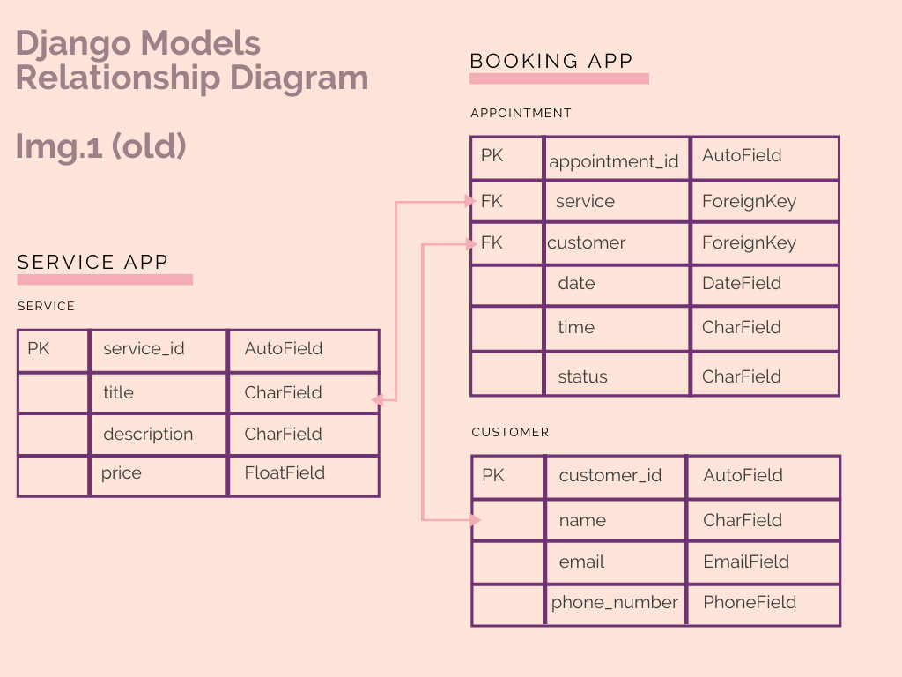
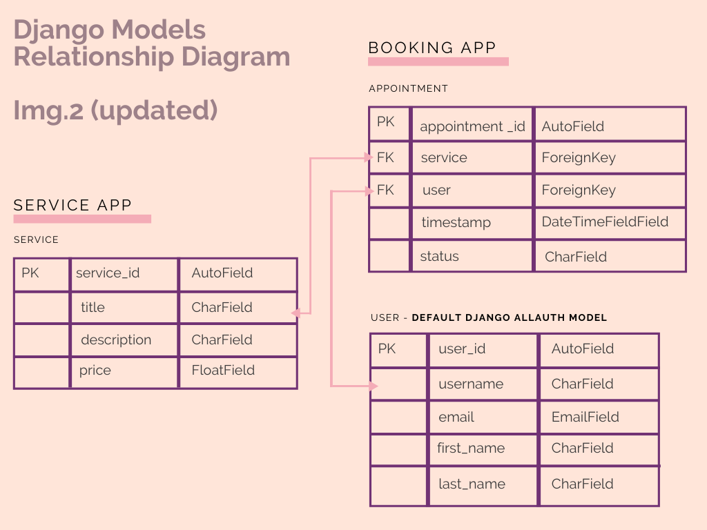

# Get Nailed with Dany

[Link to live website]

[Image Responsiveness]

## About Get Nailed with Dany
Get Nailed with Dany is a web application targeted at Amsterdam-based individuals who are interested in getting nail design services. As a full-stack framework web application, it uses Django, Python, HTML, CSS and JavaScript. This is a B2C (Business to Customer) designed to create better user experience to clients and provide useful management tools for the business owner. 

---

## UX/UI
Using core Design Thinking methods and Agile practices principles the strategy for this web application takes into consideration 2 personas: Business Owner and Client, and their respective problem statements. 

### Personas

#### Persona 1 (Business Owner)

Danyelle Maya, 24, Nail Designer, Single

- Brazilian living in Amsterdam – Immigrant in a new country
- Started her own business as a Nail Designer in her own home – Entrepreneurial mindset
- Only speaks Portuguese – learning English and Dutch – Limited communication in the Netherlands

Danielle is currently trying to grow her business but the lack of English knowledge makes so that she is limited to serving only Portuguese speaking clients. She wants to professionalize her services. Currently she does her bookings through WhatsApp messages. 

- Danielle has a good number of fixed Brazilian customers
- Danielle works from 9am to 6pm with short breaks in between clients
- Danielle’s work is popular on Instagram and social media

#### Persona 2 (Client)

Louise Smith, 31, Real Estate Agent, Married

- British living in Amsterdam for 7 years with her Dutch partner and 3 years old one son
- Works 32h per week and drives around the city to different locations throughout the day
- Speaks English and Dutch – Good communication skills in the Netherlands

Louise lives a busy life as a Real Estate Agent and mother. Her job requires her to present herself a certain way, she feels pressured to dress formal and have her hair and nails always done to provide a good first impression to her clients. Sometimes Louise needs to bring her son with her to appointments during the day – especially on weekends she has to work. 

- On her free time Louise goes to the Gym and spends time with her family
- Louise’s work schedule is hectic and unpredictable, sometimes with late work hours and other times with big empty windows between appointments.

### Problem Statements

- Problem Statement: Danielle Maya (Business Owner)	

    I am a nail designer trying to expand my business to a diverse group of clients but I don’t have the time to answer to all of the booking request messages and calls I get on a day because I work from 9am to 6pm with limited breaks in between which makes me feel like I can’t give the needed attention to my clients so my business will never grow.	

- Problem Statement: Louise Smith

    I am a real estate agent trying to book easy and flexible beauty services for myself but I don’t have the time to call different saloons to check if they have availibility because I am a mother with unpredictable working hours which makes me feel like if I don’t get to easily make appointments for getting my nails done, I will have to go to work with un-done nails and I won’t be taken seriously in my job. 

### User Stories

All user stories are documented with their respective acceptance criteria, story points and MoSCoW prioritization on [my Github Issues](https://github.com/anabramos/getnailedwithdany/issues)

#### Core User Stories (Must Have, Should Have)
1.	As the business owner I can log in so that I can access the site's backend.
2.	As the business owner I can accept or cancel any booking requests so that I can manage last minute changes to my schedule.
3.	As the business owner I can create, remove, update or delete the services provided from the website list so that the website always translates the services I have available at different moments.
4.	As the business owner I can update the price of services from the website list so that I can keep the website up to date to accurately reflect the market prices.
5.	As a client I can navigate the website intuitively so that I can find the information I need.
6.	As a client I can get key information about services provided and prices from the landing page so that I can decide based on that if I want to register for an account.
7.	As a client I can send any questions or concerns to the service provider through the website so that I can receive any additional information I might need.
8.	As a client I can register or log in so that I can make booking requests.
9.	As a client I can easily see when I am logged in or logged out so that I know if I need to act upon that based on what I would like to do in the website.
10.	As a client I can send a request for a booking time so that I can make an appointment to get my nails done.
11.	As a client I can delete or change an existing booking request so that my booking requests can respond to any last minute change I might have in my schedule

#### Future Features (Could Have, Won't Have)
11.	As the business owner I can prevent guests from requesting more than one time slot per week so that I can efficiently manage customer expectations and schedule.
13.	As the business owner I can see a profile picture of each client when I receive a booking request so that I know who to expect each day at my house.
14.	As a client I can see the Instagram account of the service provider on the website so that I can check the quality of her work before registering for an account.
15.	As a client I can edit my personal details so that these are up to date in case I need to be contacted by the service provider.

### Agile Practices

#### Wireframes
- All wireframes were designed with Balsamiq tool. These can be found [here](https://github.com/anabramos/getnailedwithdany/tree/main/static/documents/wireframes). Final web application will differ slightly from wireframes as it will utlize more similar structures between different pages for better visual appeal and user experience.

#### Product Backlog & Project Board
- I created my product backlog using [my Github Milestones](https://github.com/anabramos/getnailedwithdany/milestones), dividing story points more or less euqaly per iteration. This however did not translate the build up order of the project, as I had overestimated how some tasks and features are dependant from others to being build.  
- For information radiators I have made use of [my Github Projects](https://github.com/anabramos/getnailedwithdany/projects/1)

### Scope & Structure

In response to the problem statements and user stories attributed to business owner and clients, the website and its features are structured as following:

3 Custom Django apps:
1. Website
    Concerns the design of a Front-End web application that meets acessibility guidelines and provides a set for responsive user interaction via its homepage, navbar and navigation links. It contains a homepage with information about the website and navigation links that will take the client to different website features. Lastly, it presents a contact form so that (potential) clients send a message to business owner.
2. Services
    Concerns the display of all services provided by the business owner, including prices. These are directly linked to the database and can be updated at aytime by admin users. Changes on the database are also immediatelly translated to the Front-End of the website.
3. Booking
    Concerns the ability of clients to make and manage their appointments, including modifying and cancelling(delete) existing appointments. This feature is only available for registered users when logged-in. Un-registered users will be requested to create an account before making an appointment. 

This web application also utilizes built-in django applications, frameworks and libraries to compliment the above mentioned structure and features. 

#### Database Structure

The Database for this web application has undergone changes as the project developed. This is due to the fact that some of my initial planned custom models were being repetitive of already existing built-in Django Models. Initially the plan was to take 3 custom models: 'Service', 'Customer' and 'Appointment' (see Relationship Diagram Img.1). However, after developing the user account feature with allauth app, I realized that my custom Customer Model was not only very similar to allauh's User Model, but also created certain complications in terms of connecting the two. To optimize my time and my code writing, I have returned to the drawing board for rethinking my database structure. The final structure that concerns this web application uses 2 custom models: 'Service' and 'Appointment' and related to the User Model from django allauth (see Relationship Diagram Img.2).

### Design

#### Colors
The website colors are inspired by nail polish baby pastel colors. It uses the darker faded brown color to create contrast between text and background, and the other colors are used intertwined to reinforce borders, banners and highlight certain features/sections in the website.

#### Fonts
The website uses a combination of Fredoka One and Raleway fonts, with a fall back to sans-serif. These fonts are popularly paired together. Fredoka One is used in the website for high-level headings and logo while Raleway is used for regular text and low level headings. The fonts were compared and taken from Google Fonts.

#### Icons
This website makes use of icons from Font Awesome to give a new visual element and reinforce the content already displayed. The Icons are used to indicate social media links on the website's footer.

## Technologies Used

- Languages
    - [HTML5](https://en.wikipedia.org/wiki/HTML)
    - [CSS](https://en.wikipedia.org/wiki/CSS)
    - [Javascript](https://en.wikipedia.org/wiki/JavaScript)
    - [Python](https://en.wikipedia.org/wiki/Python_(programming_language))

- Libraries & Frameworks
    - [Django](https://www.djangoproject.com/)
    - [Bootstrap](https://getbootstrap.com/)
    - [Google Fonts](https://fonts.google.com/)
    - [Font Awesome](https://fontawesome.com/)

- Tools
    - [Gitpod](https://www.gitpod.io/)
    - [Github](https://github.com/)
    - [Google Chrome Developer Tools](https://developer.chrome.com/docs/devtools/)
    - [Heroku](https://dashboard.heroku.com/apps)
    - [Cloudinary](https://cloudinary.com/)
    - [SQLite](https://www.sqlite.org/index.html)
    - [PostgreSQL](https://www.postgresql.org/)
    - [MBalsamiq](https://balsamiq.com/)
    - [Coolors (color schemes generator)](https://coolors.co/)
    - [Unsplash](https://unsplash.com/)
    - [Am I Responsive?](http://ami.responsivedesign.is/)
    - [WebAIM](https://webaim.org/resources/contrastchecker/)
    - [W3C HTML Validation Service](https://validator.w3.org/)
    - [W3C CSS Validation Service](https://validator.w3.org/)
    - [Pep8](http://pep8online.com/)
    - [JSHint](https://jshint.com/)
    - [Flatpickr](https://flatpickr.js.org/)

## Deployment

The website was deployed using Heroku. My repository is build using the Code Institute Python Essentials Template. The deployment was done on the first day of building this repository. To deploy this website I used Code Institute's Django Deployment Instructions provided in the course section I Think Therefore I Blog > Getting Set Up > Creating The Django Project Checklist. 

For deployment, the following steps were taken:

- On my gitpod workspace - Command Line:
1. Install Django - `pip3 install Django==3.2 gunicorn`
2. Install Django supporting libraries: Psycopg2 and Cloudinary `pip3 install dj_database_url psycopg2` | `pip3 install dj3-cloudinary-storage`
3. Update requirements.txt file `pip3 freeze --local > requirements.txt`
4. Create Django Project and relevant apps `django-admin startproject PROJ_NAME .` | `python3 manage.py startapp APP_NAME` 
5. Add installed apps to settings.py file
6. Migrate Chnages `python3 manage.py migrate`
7. Run server for testing `python3 manage.py runserve`
- On Heroku:
8. Create new Heroku app
9. Add Heroku Postgres Add-ons from Heroku's resource tab
10. Copy DATABASE_URL value to Heroku's Config Vars under settings tab
- On my gitpod workspace - Directory:
11. Create env.py file
12. Import os library
13. Set up DATABASE_URL and SECRET_KEY environment variables
- On Heroku:
14. Set SECRET_KEY value to Heroku's Config Vars under settings tab
- On my gitpod workspace - Settings.py file:
15. Import os library and set up database to function on local environemt
16. Add replacement SECRET_KEY value
17. Comment out DATABASE = { } section
18. Add new DATABASE section that links with Heroku's config var 
- On my gitpod workspace - Command Line:
19. Save all files and make migrations `python3 manage.py migrate`
- On my Cloudinary account:
20. Copy my CLOUDINARY_URL from Dashboard
- On my gitpod workspace - env.py file:
21. Add Cloudinary URL to env.py file
- On Heroku:
22. Add Cloudinary URL to Heroku Config Vars
23. Add DISABLE_COLLECTSTATIC to Heroku Config Vars 
- On my gitpod workspace - Settings.py file:
24. Add Cloudinary Libraries to installed apps
25. Tell Django to use Cloudinary to store media and static files by setting up Static Files Storage variables
26. Add Heroku Hostname to ALLOWED_HOSTS
- On my gitpod workspace - Directory:
27. Create procfile on the top level directory
28. Add code to Procfile `web: gunicorn PROJ_NAME.wsgi`
- On my gitpod workspace - Command Line:
29. Perform Git control and push changes to repository
- On Heroku:
30. Deploy it manually to Heroku using GitHub, using main branch 

### Forking
To use this project as a reference or starting point, or even to propose changes to it, you can fork this repository by following these steps:
From the GitHub repository page click on 'Fork' in the top-right corner.
Create a new repository with a new name based on this project.
Make sure to credit the project in case you decide to use any of the original code.

## Credits
Content
- For the extension of the django allauth User Model I used the tutorial from GeeksforGeeks. 

Media
- All images for this website were taken from Unsplash.

  - Hero-image - Pink Nails: Photo by [Element5 Digital](https://unsplash.com/@element5digital) 

  - Persona 1 README- Happy Girl: Photo by [Michael Dam](https://unsplash.com/@michaeldam) 

  - Persona 2 README - Sales woman sitting in cafe coffee shop: Photo by [LinkedIn Sales Solutions](https://unsplash.com/@linkedinsalesnavigator) 

## Acknowledgements

A huge thanks to my mentor Samantha Dartnall, the CI slack community and tutoring team, and my friends who tested the website at least 1000x.